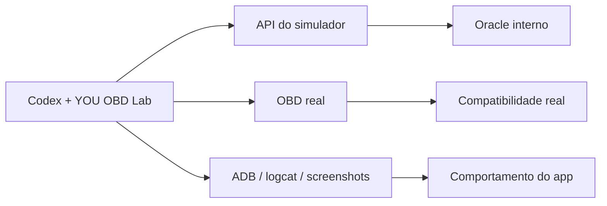

# YOU OBD Lab Plugin


Plugin local do Codex para transformar o ecossistema YOU em um laboratorio de validacao integrado:

- `YouSimuladorOBD`
- `YouAutoCarvAPP2`
- celular Android real via `ADB`
- adaptadores `ELM327` e `OBDLink`

## O que ele resolve

O plugin ajuda o Codex a:

- preparar cenarios no simulador via API
- validar comportamento real via OBD
- acompanhar o app Android no celular
- comparar `API do simulador`, `OBD real` e `UI/logs do app`
- registrar evidencias de bancada

Em outras palavras, ele tira o fluxo do modo "depende da memoria" e coloca em um laboratorio repetivel.

## Modelo de validacao

O plugin trabalha com tres verdades:

1. `API do simulador`
2. `OBD real`
3. `ADB/logcat/screenshots`

Interpretacao:

- `API` diz o que o simulador acredita que esta acontecendo
- `OBD` diz o que um scanner/app real realmente viu
- `ADB/logcat` diz o que o app Android exibiu e como ele se comportou



## Repositorios relacionados

- `C:\www\YouSimuladorOBD`
- `C:\www\YouAutoCarvAPP2`

## Workspace fonte

Este workspace e a fonte de verdade do plugin:

- `C:\www\you-obd-lab-plugin`

## Instalacao ativa no Codex

Nesta maquina, a instalacao ativa do plugin fica em:

- `C:\Users\haise\.codex\.tmp\plugins\plugins\you-obd-lab`

Marketplace lido pela interface do Codex:

- `C:\Users\haise\.codex\.tmp\plugins\.agents\plugins\marketplace.json`

## Estrutura

- `.codex-plugin/plugin.json`
- `CHANGELOG.md`
- `WORKSPACE.md`
- `assets/`
- `scripts/`
- `skills/you-obd-android-lab/`

## Skill principal

O plugin expoe a skill:

- `you-obd-android-lab`

Use quando a tarefa cruza firmware, API, OBD real e Android.

## Exemplos de prompts

- `Use $you-obd-android-lab para validar o simulador com o app Android e o celular real`
- `Compare API, OBD real e UI do app em um teste de regressao`
- `Prepare um cenario no simulador e valide o fluxo no YouAutoCarvAPP2`
- `Verifique se a tela do app bate com o freeze frame entregue pela ECU simulada`

## Scripts uteis

Publicar o workspace para o diretorio ativo do Codex:

```powershell
powershell -ExecutionPolicy Bypass -File "C:\www\you-obd-lab-plugin\scripts\sync-to-codex.ps1"
```

Trazer de volta o plugin ativo do Codex para o workspace:

```powershell
powershell -ExecutionPolicy Bypass -File "C:\www\you-obd-lab-plugin\scripts\sync-from-codex.ps1"
```

Gerar snapshot completo da bancada:

```powershell
powershell -ExecutionPolicy Bypass -File "C:\www\you-obd-lab-plugin\scripts\collect-you-obd-lab-snapshot.ps1"
```

Monitorar o status da API em loop:

```powershell
powershell -ExecutionPolicy Bypass -File "C:\www\you-obd-lab-plugin\scripts\watch-you-obd-status.ps1"
```

## Fluxo recomendado de manutencao

1. editar o plugin em `C:\www\you-obd-lab-plugin`
2. rodar `sync-to-codex.ps1`
3. reabrir o Codex se necessario
4. validar o comportamento do plugin na UI

Assim o plugin deixa de ficar preso apenas ao diretorio interno do Codex.

## Troubleshooting

Se o plugin nao aparecer na interface:

1. confirme se `you-obd-lab` existe em `C:\Users\haise\.codex\.tmp\plugins\plugins\`
2. confirme se ele esta listado em `C:\Users\haise\.codex\.tmp\plugins\.agents\plugins\marketplace.json`
3. rode `sync-to-codex.ps1`
4. feche e abra o Codex novamente

## Documentacao relacionada

- documentacao operacional no projeto: `C:\www\YouSimuladorOBD\docs\18-codex-plugin-you-obd-lab.md`
- changelog do plugin: [CHANGELOG.md](CHANGELOG.md)
- notas do workspace: [WORKSPACE.md](WORKSPACE.md)
