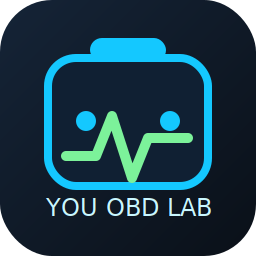
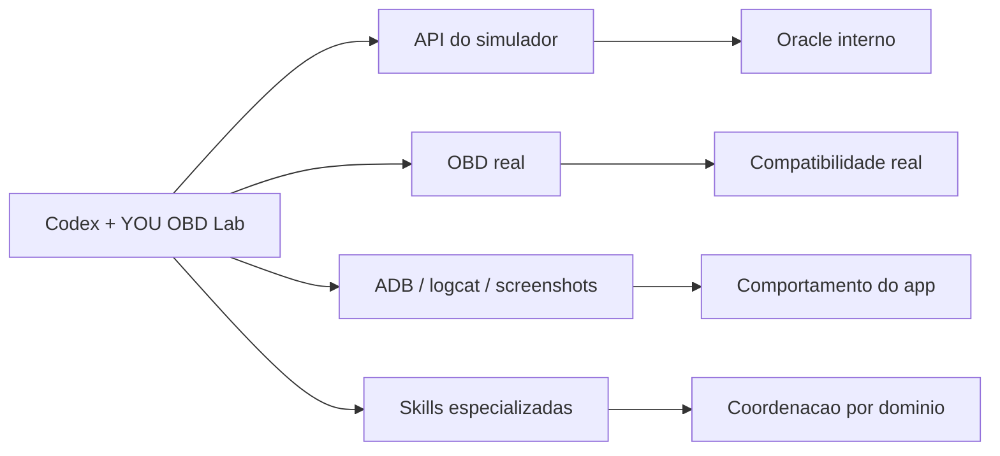

# YOU OBD Lab Plugin



Plugin local do Codex para transformar o ecossistema YOU em um laboratorio de validacao integrado e, agora, em um hub multi-skill para:

- `YouSimuladorOBD`
- `YouAutoCarvAPP2`
- `firmware/YouAutoTester`
- celular Android real via `ADB`
- adaptadores `ELM327` e `OBDLink`
- gateway BLE e hardware de bancada

Credencial dedicada padrao da API do simulador para automacao:

- usuario: `api`
- senha: `obdapi2026`

Para ambiente local com credenciais mais fortes, os scripts tambem aceitam:

- `YOU_OBD_API_USER`
- `YOU_OBD_API_PASSWORD`
- `scripts/local-api-credentials.json`

Formato do arquivo local:

```json
{
  "user": "youapi",
  "password": "sua-senha-forte"
}
```

## O que ele resolve

O plugin ajuda o Codex a:

- preparar cenarios no simulador via API
- validar comportamento real via OBD
- acompanhar o app Android no celular
- trabalhar no `firmware/YouAutoTester` com foco de laboratorio
- comparar `API do simulador`, `OBD real` e `UI/logs do app`
- revisar regressao, riscos e contratos entre projetos
- registrar evidencias de bancada

Em outras palavras, ele tira o fluxo do modo "depende da memoria" e coloca em um laboratorio repetivel, com skills especializadas por dominio.

## Arquitetura multi-skill

O plugin continua com a skill transversal original e agora funciona como um hub com especializacao por dominio:

- `you-obd-android-lab`
  Skill ampla do laboratorio. Use quando a tarefa cruza simulador, Android, celular real e adaptadores OBD.
- `you-orchestrator`
  Coordena arquitetura, contratos, payloads JSON, eventos WebSocket e impacto cruzado entre projetos.
- `youautotester-lab`
  Especialista em `firmware/YouAutoTester`, `TestResult`, `Reading`, WebUI local, API HTTP local e WebSocket local.
- `you-android-gateway`
  Especialista em Android, `ADB`, BLE, Bluetooth, captura do IKRO `IK2029B` e envio de leituras ao `YouAutoTester`.
- `you-obd-simulator`
  Especialista em `YouSimuladorOBD`, perfis, modos, cenarios, DTCs e consistencia entre API e fluxo OBD real.
- `you-reviewer`
  Especialista em revisao, regressao, contratos, riscos tecnicos e QA transversal.

Espaco futuro:

- `you-web-lab`
  Mantido como direcao futura para interfaces web do ecossistema, sem implementacao obrigatoria neste momento.

## Modelo de validacao

O laboratorio continua trabalhando com tres verdades:

1. `API do simulador`
2. `OBD real`
3. `ADB/logcat/screenshots`

Interpretacao:

- `API` diz o que o simulador acredita que esta acontecendo
- `OBD` diz o que um scanner/app real realmente viu
- `ADB/logcat` diz o que o app Android exibiu e como ele se comportou



## Repositorios relacionados

- `C:\www\YouSimuladorOBD`
- `C:\www\YouAutoCarvAPP2`

## Workspace fonte

Este workspace e a fonte de verdade do plugin:

- `C:\www\you-obd-lab-plugin`

## Instalacao ativa no Codex

Nesta maquina, a instalacao ativa do plugin fica em:

- `C:\Users\haise\.codex\.tmp\plugins\plugins\you-obd-lab`

Marketplace lido pela interface do Codex:

- `C:\Users\haise\.codex\.tmp\plugins\.agents\plugins\marketplace.json`

## Estrutura

```text
you-obd-lab-plugin/
  .codex-plugin/
    plugin.json
  assets/
  fixtures/
  scripts/
  skills/
    you-obd-android-lab/
    you-orchestrator/
    youautotester-lab/
    you-android-gateway/
    you-obd-simulator/
    you-reviewer/
```

## Quando usar cada skill

- `you-obd-android-lab`
  Quando a tarefa precisa cruzar API do simulador, OBD real, Android e evidencias de bancada.
- `you-orchestrator`
  Quando a mudanca cruza mais de um repositorio, altera contratos ou precisa de analise de impacto fim a fim.
- `youautotester-lab`
  Quando o foco esta em `firmware/YouAutoTester`, instrumentos, leituras, `TestResult` ou WebUI/API local do tester.
- `you-android-gateway`
  Quando o foco esta em Android, `ADB`, BLE, gateway do IKRO ou transporte de leituras para o tester.
- `you-obd-simulator`
  Quando o foco esta em perfis, modos, cenarios, DTCs, freeze frame e coerencia do `YouSimuladorOBD`.
- `you-reviewer`
  Quando a tarefa principal e revisar risco, regressao, QA ou consistencia entre contratos.

## Exemplos de prompts

- `Use $you-obd-android-lab para validar o simulador com o app Android e o celular real`
- `Use $you-orchestrator para coordenar uma mudanca entre YouAutoCarvAPP2, YouSimuladorOBD e o plugin`
- `Use $youautotester-lab para trabalhar no firmware/YouAutoTester e na API local de leituras`
- `Use $you-android-gateway para depurar BLE, ADB e o gateway do IKRO`
- `Use $you-obd-simulator para montar um cenario com profile, mode, scenario e DTCs`
- `Use $you-reviewer para revisar regressao, contratos e riscos tecnicos antes do merge`

## Scripts uteis

Publicar o workspace para o diretorio ativo do Codex:

```powershell
powershell -ExecutionPolicy Bypass -File "C:\www\you-obd-lab-plugin\scripts\sync-to-codex.ps1"
```

Trazer de volta o plugin ativo do Codex para o workspace:

```powershell
powershell -ExecutionPolicy Bypass -File "C:\www\you-obd-lab-plugin\scripts\sync-from-codex.ps1"
```

Gerar snapshot completo da bancada:

```powershell
powershell -ExecutionPolicy Bypass -File "C:\www\you-obd-lab-plugin\scripts\collect-you-obd-lab-snapshot.ps1"
```

Monitorar o status da API em loop:

```powershell
powershell -ExecutionPolicy Bypass -File "C:\www\you-obd-lab-plugin\scripts\watch-you-obd-status.ps1"
```

Rodar uma validacao de bancada completa com simulador + Android + relatorio:

```powershell
powershell -ExecutionPolicy Bypass -File "C:\www\you-obd-lab-plugin\scripts\invoke-you-obd-bench-validation.ps1" `
  -SimulatorBaseUrl "http://192.168.1.11" `
  -ProfileId "peugeot_308_16thp" `
  -ModeId 2 `
  -ScenarioId "superaquecimento" `
  -DtcCodes "P0300","P0420"
```

Isso gera:

- `report.md`
- `report.json`
- `api-status-before/after`
- `api-diagnostics-before/after`
- screenshot do celular
- logcat bruto e filtrado
- inventario do device via `adb`

## Fluxo recomendado de manutencao

1. editar o plugin em `C:\www\you-obd-lab-plugin`
2. rodar `sync-to-codex.ps1`
3. reabrir o Codex se necessario
4. validar o comportamento do plugin na UI

## Automacao de teste

O fluxo recomendado para testes reais continua sendo:

1. preparar o simulador por API
2. opcionalmente aplicar `profile`, `mode`, `scenario` e `dtcs`
3. abrir o app Android no celular
4. capturar `status`, `diagnostics`, screenshot e logcat
5. gerar um relatorio unico em Markdown/JSON

O script `invoke-you-obd-bench-validation.ps1` faz isso em uma passada.

Para validar o app em emulador reaproveitando o fluxo oficial do `YouAutoCarvAPP2`:

```powershell
powershell -ExecutionPolicy Bypass -File "C:\www\you-obd-lab-plugin\scripts\invoke-you-autocar-emulator-validation.ps1" `
  -Route /profile/settings `
  -ExpectedText "Configuracoes","Versao em execucao:" `
  -ScrollCount 4 `
  -StopExistingFlutterProcesses
```

Assim o plugin deixa de ficar preso apenas ao diretorio interno do Codex.

## Compatibilidade

- A skill `you-obd-android-lab` foi preservada sem remocao.
- O manifesto continua apontando para `./skills/`, entao a descoberta das novas skills permanece compativel com a estrutura atual do plugin.
- Nenhuma dependencia pesada nova foi adicionada.

## Troubleshooting

Se o plugin nao aparecer na interface:

1. confirme se `you-obd-lab` existe em `C:\Users\haise\.codex\.tmp\plugins\plugins\`
2. confirme se ele esta listado em `C:\Users\haise\.codex\.tmp\plugins\.agents\plugins\marketplace.json`
3. rode `sync-to-codex.ps1`
4. feche e abra o Codex novamente

## Documentacao relacionada

- documentacao operacional no projeto: `C:\www\YouSimuladorOBD\docs\18-codex-plugin-you-obd-lab.md`
- changelog do plugin: [CHANGELOG.md](CHANGELOG.md)
- notas do workspace: [WORKSPACE.md](WORKSPACE.md)
